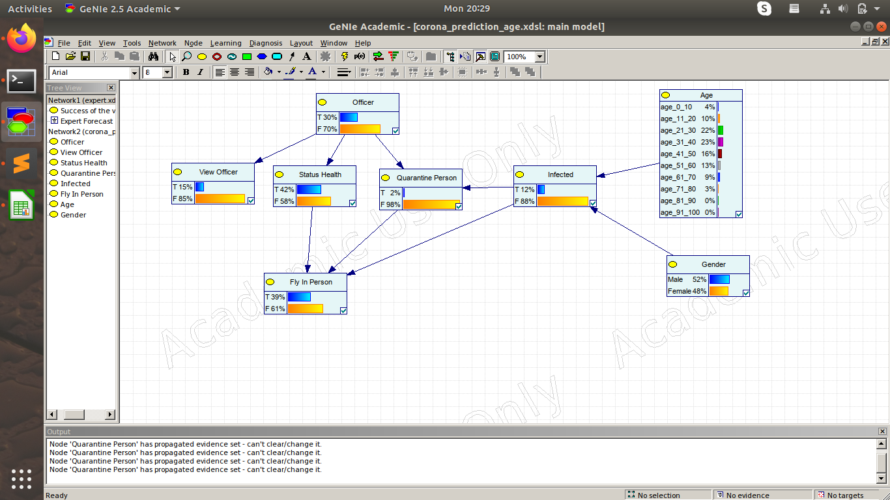

# Team Members
1. Vamsi Nallappareddy (2017A7PS0018H)
2. Rohit Dwivedula (2017A7PS0029H)
3. Varad Kshirsagar (2017A7PS0141H)

# Software 

This bayesian network was modelled using Genie, running on Ubuntu 18.04 LTS with WINE for Linux support. 

# Assumptions Made
1. In the base variant, P(infected=T) is assumed to be 0.1
2. In the expanded variant, we include some demographic data as well as data on how the infection affects people of different ages. For getting the population distribution of ages and gender, we used the data from [this 2019 India population pyramid](https://www.populationpyramid.net/india/2019/). Only the data for ages 1-100 was considered (since this is the range for which we have Corona Data available). For this data, P(Gender=Male) = 0.519 and P(Gender=Female) = 0.481 (to three decimals). The demographic data used in the age node is:

| Age Group  | # People  | Probability       |
| ---------- | --------- | ----------------- |
| age_0_10   | 124095432 | 0.174754297292068 |
| age_11_20  | 133337226 | 0.187768823211025 |
| age_21_30  | 126082728 | 0.177552857322798 |
| age_31_40  | 111082032 | 0.156428501283875 |
| age_41_50  | 85405312  | 0.120269900696827 |
| age_51_60  | 63985759  | 0.090106349367837 |
| age_61_70  | 42416413  | 0.059731855782292 |
| age_71_80  | 17844453  | 0.025129005913581 |
| age_81_90  | 5300919   | 0.007464886981877 |
| age_91_100 | 563491    | 0.000793522147821 |

3. The agewise distribution of Corona cases(in India) is given by ([source](https://www.covid19india.org/deepdive)):

| Age Group  | # Cases | Probability       |
| ---------- | ------- | ----------------- |
| age_0_10   | 98      | 0.041808873720137 |
| age_11_20  | 228     | 0.097269624573379 |
| age_21_30  | 514     | 0.219283276450512 |
| age_31_40  | 537     | 0.229095563139932 |
| age_41_50  | 383     | 0.16339590443686  |
| age_51_60  | 306     | 0.130546075085324 |
| age_61_70  | 204     | 0.08703071672355  |
| age_71_80  | 61      | 0.026023890784983 |
| age_81_90  | 10      | 0.004266211604096 |
| age_91_100 | 3       | 0.001279863481229 |

Using this data, we modelled the P(infection | age, gender). Statistics currently available on Corona suggest that the proportions of male and female corona confirmed cases in India are 0.668 and 0.332 respectively. (based on a study of 5313 patients/samples). Now we need to model the probability of infection based on the observations of age and gender. We assumed that the probability of getting infected for a specific age group is the proportion of the number of cases from that age group compared to the total. Also, the probability of females getting corona, for all age groups is assumed to be half as much as the males of the same group. These is a very simple but basic model. Take a look at the final graph below:

We see that the overall probability for infection is 0.12, pretty much in line with the number of 0.1 used for the simpler graph.  

# Note

The information on the website was accessed on 27th April, 2020 at 7:30PM approximately. As the situation evolves, the numbers presented above will change. For archival purposes we have saved snapshots of the web pages (on the Internet Archive) of how it looked like when we accessed it so that our raw data has some backing.

1. [Population Pyramid](http://web.archive.org/web/20200427142447/https://www.populationpyramid.net/india/2019/)
2. [Corona Data](http://web.archive.org/web/20200427142759/https://www.covid19india.org/deepdive)